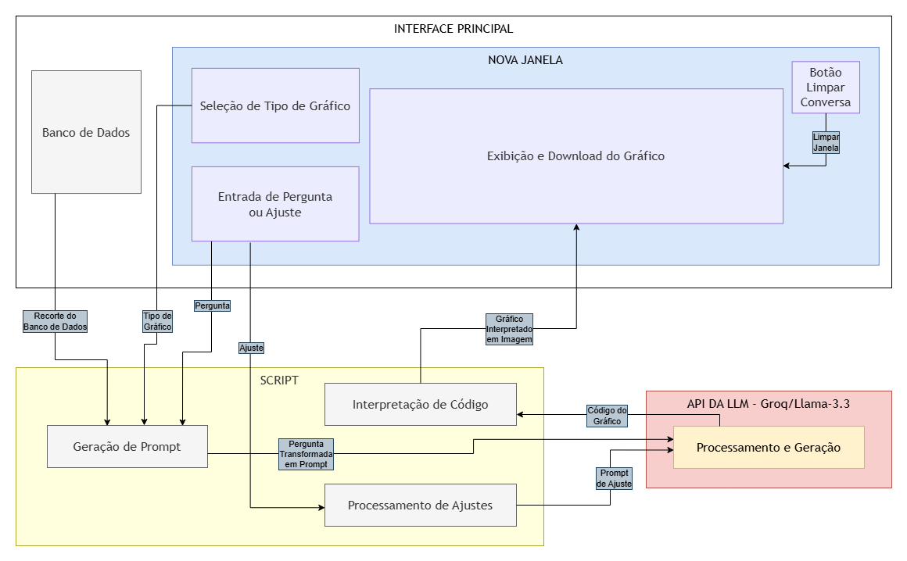

# FastGraphGen

* **Título do TCC:** FastGraphGen: Uma Interface Baseada em IA Generativa para Visualização Dinâmica de Dados do DATASUS
* **Alunos:** Sérgio L. Lemos Junior
* **Semestre de Defesa:** 2026-1

[PDF do TCC](./Sergio_L_Lemos_Jr_-_TCC2_--_FastGraphGen_-_Uma_Interface_Baseada_em_IA_Generativa_para_Visualizacao_Dinamica_de_Dados_do_DATASUS.pdf)

# Descrição Geral

A tuberculose, embora curável e evitável, ainda é uma grave ameaça à saúde pública no Brasil. Para apoiar pesquisas epidemiológicas, o DATASUS disponibiliza ferramentas como o SINAN e o TABNET, mas seu uso costuma exigir conhecimento técnico e tempo de análise.

Este trabalho dá continuidade ao projeto iniciado por Thiago Chaves [Chaves 2025], que implementou uma arquitetura de back-end baseada em LLM e RAG (Retrieval-Augmented Generation) para converter linguagem natural em consultas SQL sobre os dados do DATASUS, e por Mrcos Faben [de Mesquita Faben 2026], que desenvolveu o front-end (React + Observable Plot) responsável por transformar essas consultas em painéis interativos e mapas coropléticos. A versão original deles pode ser encontrada em ```https://github.com/marcos-2002/datasus-tuberculose-RAG```

O **FastGraphGen** complementa essa base com um novo "motor" de geração de gráficos: uma janela de chat dedicada, integrada à interface já existente, que permite ao usuário gerar e editar gráficos específicos (linhas, barras agrupadas, setores e heatmap) usando apenas linguagem natural, sem depender exclusivamente das visualizações automáticas geradas pelo chat principal.

Para evitar alucinações numéricas — um problema recorrente em ferramentas de IA generativa aplicadas à visualização de dados — a solução adota uma abordagem de dataset estático: os dados reais do DATASUS são embutidos no frontend em formato JSON, e o LLM é instruído a usar exclusivamente esses valores na construção dos gráficos, atuando apenas como gerador de código Vega-Lite e não como fonte dos dados em si.

## Novos arquivos
* *BluePanel.jsx* -> ..\datasus-tuberculose-RAG\frontend\src\modules\chat\components
  * Arquivo responsável por dar forma à interface da noja janela e fazer parte da verificação/comunicação com a API do Groq;
* *groqService.js* -> ..\datasus-tuberculose-RAG\frontend\src\modules\chat
  * Script responsável pela comunicação entre interface e API e pela geração e tradução dos gráficos Vega Lite em imagem;
* *index.jsx* -> ..\datasus-tuberculose-RAG\frontend\src\modules\chat
  * Versão modificada do index do projeto original para comportar a nova janela do Painel Azul;
* *VegaChart.jsx* -> ..\datasus-tuberculose-RAG\frontend\src\modules\chat\components
  * Arquivo responsável pela compatibilidade com o Vega Lite na geração de gráficos.
  
## Funcionalidades

* **Painel Azul (nova janela de geração de gráficos)**
  * Acessível por um botão no canto superior direito da interface principal
  * Caixa de entrada de texto para perguntas em linguagem natural
  * Barra de seleção com 5 tipos de gráfico: Linhas, Barras Agrupadas, Setores, Heatmap e Automático (a LLM escolhe o mais adequado)
  * Botão de limpar conversa para iniciar um novo gráfico com outro recorte de dados
  * Download do gráfico gerado em formato SVG ou PNG
* **Geração de gráficos via LLM**
  * Prompt construído dinamicamente a partir da pergunta do usuário, do tipo de gráfico escolhido e de um recorte relevante do dataset
  * Resposta da API interpretada como especificação Vega-Lite v5 (JSON) e renderizada na tela
  * Mensagens seguintes no mesmo chat funcionam como ajustes (cores, título, layout etc.) sobre o gráfico já gerado, sem alterar os valores numéricos
* **Mitigação de alucinações**
  * Uso de dataset estático (dados reais do DATASUS embutidos no frontend) em vez de depender do conhecimento geral do modelo
  * Seleção de dataset por palavras-chave em português, conforme o contexto da pergunta
* **Modelo utilizado**
  * API Groq com o modelo `llama-3.3-70b-versatile`, escolhido pela acessibilidade gratuita, velocidade de resposta e facilidade de configuração de chave de API

## Arquitetura



O fluxo funciona da seguinte forma:
1. O usuário escolhe um tipo de gráfico e envia uma pergunta na nova janela (Painel Azul).
2. Um script em JavaScript transforma a pergunta em um prompt, anexando instruções específicas do tipo de gráfico e um recorte relevante do banco de dados.
3. O prompt é enviado à API da LLM (Groq), que retorna uma especificação Vega-Lite (JSON).
4. O script interpreta esse JSON e renderiza o gráfico na interface.
5. Mensagens subsequentes na mesma janela são tratadas como ajustes sobre o gráfico já gerado (cores, título, etc.), sem alterar os dados.

Este módulo se conecta à arquitetura já existente do projeto original (backend em FastAPI + RAG + SQL, banco PostgreSQL, frontend React/Vite), atuando como uma camada adicional e paralela ao chat principal.

## Pré Requisitos

1. Docker instalado

   Se você não possui o docker instalado, visite https://www.docker.com/get-started/

2. Chave de API do Gemini

   Se você não tem uma chave de API do Gemini, visite https://aistudio.google.com/app/apikey (o Gemini possui limite gratuito. você pode alterar o modelo usado no llm_service.py)

3. Chave de API do Groq

   Se você não tem uma chave de API do Groq, visite https://console.groq.com/keys (caso tenha interesse em alterar o modelo usado, edite o arquivo groqService.js)

4. yarn ou npm

## Como começar

1. Clone o repositório:

   ```bash
   git clone https://github.com/EIC-BCC/26_1-FastGraphGen.git
   ```

2. Navegue até o diretório do projeto:

   ```bash
   cd 26_1-FastGraphGen
   ```

3. Crie o arquivo .env

   ```cp .env.example .env``` (linux/mac)


   ```copy .env.example .env``` (windows)

3.1. Coloque a sua chave de API do Gemini em LLM_KEY, e depois a chave de API do Groq em GROQ_KEY. O arquivo deve estar estruturado da seguinte forma:
   
	```bash
	LLM_KEY=sua_chave_gemini_aqui
	GROQ_KEY=sua_chave_groq_aqui
	DB_PORT=5432
	DB_USER=local
	DB_DATABASE=local
	DB_PASS=local
	```

3.2. Trocar no menu inferior do arquivo docker-entrypoint.sh CRLF para LF 


3.3 No arquivo docker compose.yml trocar a ultima linha para
```
command: ["/app/docker-entrypoint.sh"]
```

4. Rode o Docker
   ```bash
   docker compose up
   ```

   Esse comando irá subir o banco de dados e a API

5. Rode as seeds
   ```bash
   docker exec -it api python3 seed_data.py
   ```

6. Importe os dados do datasus

   faça um get para
   ```bash
   http://localhost:8000/etl
   ```
   é possível acompanhar os logs executando
   ```bash
   docker logs api
   ```

6. Rode o frontend <br>
   Em um novo terminal, navegue até a pasta `frontend`:
   ```bash
   cd frontend
   ```
   Crie um arquivo .env na pasta frontend com o seguinte conteúdo:
   ```env
   VITE_API_URL=http://localhost:8000
   ```
   Em seguida, execute:
   ```bash
   yarn install
   yarn dev
   ```

